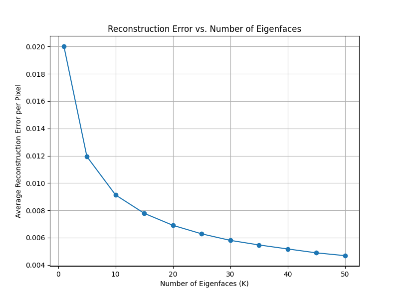

# Face Analysis and Synthesis Using PCA and Fisher Linear Discriminant

## Overview

This project explores the analysis and synthesis of human faces using Principal Component Analysis (PCA) and Fisher Linear Discriminant (FLD). It focuses on extracting facial features, reconstructing face images and landmarks, synthesizing new faces, and classifying gender based on facial characteristics.

---

## Project Structure

The project is organized into three core tasks:

1. **Face Reconstruction Using Eigenfaces**
2. **Landmark-Based Reconstruction Using Eigen-Warpings**
3. **Gender Classification Using Fisher Faces**

---

## Methodology

### 1. Face Reconstruction Using Eigenfaces

- **Eigenface Generation:** PCA is applied to face images to compute eigenfaces that capture global facial features.
- **Reconstruction:** Test images are reconstructed using top `K` eigenfaces.
- **Error Analysis:** Reconstruction error decreases as `K` increases.

**Visuals:**
- 
- 
- 

---

### 2. Landmark-Based Reconstruction Using Eigen-Warpings

- **Eigen-Warpings:** PCA on facial landmarks to obtain eigen-warpings capturing shape variations.
- **Reconstruction Quality:** High-quality shape reconstructions.
- **Error Analysis:** Error decreases with more components, especially up to `K = 10`.

**Visuals:**
- 
- 
- 

---

### 3. Combined Shape and Appearance Reconstruction

- **Process:** Landmarks projected onto eigen-warpings for shape estimation. Appearance reconstructed via eigenfaces and warped to predicted shape.
- **Results:** Faces preserve identity, but fine details may be distorted.

**Visuals:**
- 
- 
- 

---

### 4. Synthetic Face Generation

- **Method:** Generate random shape and appearance vectors from scaled PCA components.
- **Results:** 50 novel faces with varied characteristics.

**Visuals:**
- 

---

### 5. Gender Classification Using Fisher Faces

- **Dataset:** 1,000 face images (412 male, 588 female)
- **Feature Extraction:** 60D vector per face (10 shape + 50 appearance)
- **FLD:** Computes direction for gender separation.
- **Results:** 13.5% classification error. Appearance features outperform shape-only.

**Visuals:**
- 
- 
- 

---

## Key Findings

- PCA effectively captures appearance and shape variation for face synthesis and reconstruction.
- FLD achieves promising results for gender classification (13.5% error).
- Appearance-based features provide stronger discriminative power than geometry alone.

---

## Usage

### 1. Data Preparation

- Collect face images and their landmark annotations (e.g., `.mat` or `.csv`).

### 2. Install Dependencies

```bash
pip install numpy scipy scikit-learn opencv-python scikit-image matplotlib
